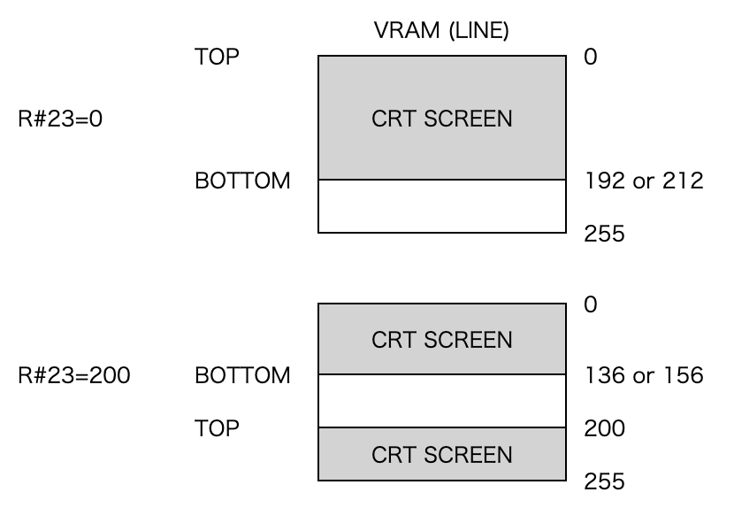

# レジスタ

　ここでは、VDPを制御するコントロールレジスタ、ステータスレジスタについて説明します。

## 1 コントロールレジスタ#0～#23、#32～#46(Write only)

|      |   7 |   6 |   5 |   4 |   3 |   2 |   1 |   0 |                                                              |
| ---- | --- | --- | --- | --- | --- | --- | --- | --- | ------------------------------------------------------------ |
| R#0  |   0 |  DG | IE2 | IE1 |  M5 |  M4 |  M3 |   0 | Mode register 0                                              |
| R#1  |   0 |  BL | IE0 |  M1 |  M2 |   0 |  SI | MAG | Mode register 1                                              |
| R#2  |   0 | A16 | A15 | A14 | A13 | A12 | A11 | A10 | Pattern name table base address register                     |
| R#3  | A13 | A12 | A11 | A10 | A9  | A8  | A7  | A6  | Color table base address register low                        |
| R#4  |   0 |   0 | A16 | A15 | A14 | A13 | A12 | A11 | Pattern generator table base address register                |
| R#5  | A14 | A13 | A12 | A11 | A10 | A9  |   1 |   1 | Sprite attribute table base address register low             |
| R#6  | 0   |   0 | A16 | A15 | A14 | A13 | A12 | A11 | Sprite pattern generator table base address register         |
| R#8  |  MS |  LP |  TP |  CB |  VR |   0 | SPD |  BW | Mode register 2                                              |
| R#9  |  LN |   0 |  S1 |  S0 |  IL |  EO |  NT |  DC | Mode register 3                                              |
| R#7  | TC3 | TC2 | TC1 | TC0 | BD3 | BD2 | BD1 | BD0 | Text color/Back drop color register (GRAPHIC 7 モード時以外) |
| R#7  | BD7 | BD6 | BD5 | BD4 | BD3 | BD2 | BD1 | BD0 | Text color/Back drop color register (GRAPHIC 7 モード時)     |
| R#10 |   0 |   0 |   0 |   0 |   0 | A16 | A15 | A14 | Color table base address register high                       |
| R#11 |   0 |   0 |   0 |   0 |   0 |   0 | A16 | A15 | Sprite attribute table base address register high            |
| R#12 | T23 | T22 | T21 | T20 | BC3 | BC2 | BC1 | BC0 | Text color/Back color register                               |
| R#13 | ON3 | ON2 | ON1 | ON0 | OF3 | OF2 | OF1 | OF0 | Blinking period register                                     |
| R#14 |   0 |   0 |   0 |   0 |   0 | A16 | A15 | A14 | VRAM Access base address register                            |
| R#15 |   0 |   0 |   0 |   0 |  S3 |  S2 |  S1 |  S0 | Status register pointer                                      |
| R#16 |   0 |   0 |   0 |   0 |  C3 |  C2 |  C1 |  C0 | Color palette address register                               |
| R#17 | AII |   0 |  R5 |  R4 |  R3 |  R2 |  R1 |  R0 | Color register pointer                                       |
| R#18 |  V3 |  V2 |  V1 |  V0 |  H3 |  H2 |  H1 |  H0 | Display adjust register                                      |
| R#19 | IL7 | IL6 | IL5 | IL4 | IL3 | IL2 | IL1 | IL0 | Interrupt line register                                      |
| R#20 |   0 |   0 |   0 |   0 |   0 |   0 |   0 |   0 | Color burst register 1                                       |
| R#21 |   0 |   0 |   1 |   1 |   1 |   0 |   1 |   1 | Color burst register 2                                       |
| R#22 |   0 |   0 |   0 |   0 |   0 |   1 |   0 |   1 | Color burst register 3                                       |
| R#23 | DO7 | DO6 | DO5 | DO4 | DO3 | DO2 | DO1 | DO0 | Display offset register                                      |

|      |   7 |   6 |   5 |   4 |   3 |   2 |   1 |   0 |                               |
| ---- | --- | --- | --- | --- | --- | --- | --- | --- | ----------------------------- |
| R#32 | SX7 | SX6 | SX5 | SX4 | SX3 | SX2 | SX1 | SX0 | Source X low register         |
| R#33 |   0 |   0 |   0 |   0 |   0 |   0 |   0 | SX8 | Source X high register        |
| R#34 | SY7 | SY6 | SY5 | SY4 | SY3 | SY2 | SY1 | SY0 | Source Y low register         |
| R#35 |   0 |   0 |   0 |   0 |   0 |   0 | SY9 | SY8 | Source Y high register        |
| R#36 | DX7 | DX6 | DX5 | DX4 | DX3 | DX2 | DX1 | DX0 | Destination X low register    |
| R#37 |   0 |   0 |   0 |   0 |   0 |   0 |   0 | DX8 | Destination X high register   |
| R#38 | DY7 | DY6 | DY5 | DY4 | DY3 | DY2 | DY1 | DY0 | Destination Y low register    |
| R#39 |   0 |   0 |   0 |   0 |   0 |   0 | DY9 | DY8 | Destination Y high register   |
| R#40 | NX7 | NX6 | NX5 | NX4 | NX3 | NX2 | NX1 | NX0 | Number of dot X low register  |
| R#41 |   0 |   0 |   0 |   0 |   0 |   0 |   0 | NX8 | Number of dot X high register |
| R#42 | NY7 | NY6 | NY5 | NY4 | NY3 | NY2 | NY1 | NY0 | Number of dot Y low register  |
| R#43 |   0 |   0 |   0 |   0 |   0 |   0 | NY9 | NY8 | Number of dot Y high register |
| R#44 | CH3 | CH2 | CH1 | CH0 | CL3 | CL2 | CL1 | CL0 | Color register                |
| R#45 |   0 | MXC | MXD | MXS | DIY | DIX |  EQ | MAJ | Argument register             |
| R#46 | CM3 | CM2 | CM1 | CM0 | LO3 | LO2 | LO1 | LO0 | Command register              |

### 1.1 モードレジスタ

　モードレジスタは各種動作モードを設定するレジスタで、コントロールレジスタ#0、#1、#8、#9に配置されています。

#### Mode register 0

|     |   7 |   6 |   5 |   4 |   3 |   2 |   1 |   0 |
| --- | --- | --- | --- | --- | --- | --- | --- | --- |
| R#0 |   0 |  DG | IE2 | IE1 |  M5 |  M4 |  M3 |   0 |

- DG 1のとき、カラーバスを入力モードにして、データをVRAMに取り込む
    (デジタイズ機能を持ったMSX2でのみ使用可能)
- IE2 Interrupt Enable2(1のとき、ライトペンによる割り込みを可能にする)
- IE1 Interrupt Enable1(1のとき、水平帰線による割り込みを可能にする)
- M5 表示モードの設定に使用する
- M4 表示モードの設定に使用する
- M3 表示モードの設定に使用する

　IE2はライトペン割り込み用のビットです。MSXではこの機能は使用しないので、常に「0」にして下さい。

#### Mode register 1

|     |   7 |   6 |   5 |   4 |   3 |   2 |   1 |   0 |
| --- | --- | --- | --- | --- | --- | --- | --- | --- |
| R#1 |   0 |  BL | IE0 |  M1 |  M2 |   0 |  SI | MAG |

- BL 1=画面表示、0=画面非表示
- IE0 Interrupt Enable0(1のとき、垂直帰線による割り込みを可能にする)
- M1 表示モードの設定に使用する
- M2 表示モードの設定に使用する
- SI スプライトのサイズ　1=16×16、0=8×8
- MAG スプライトの拡大　1=拡大する、0=拡大しない

#### Mode register 2

|      |   7 |   6 |   5 |   4 |   3 |   2 |   1 |   0 | |
| ---- | --- | --- | --- | --- | --- | --- | --- | --- | ------------------------- |
| R#8  |  MS |  LP |  TP |  CB |  VR |   0 | SPD |  BW | Mode register 2 |

- MS 1=マウスを使用する(カラーバスは入力モード)、0=マウスを使用しない(カラーバスは出力モード)
- LP 1=ライトペンを使用する、0=ライトペンを使用しない
- TP カラーコード0の色をカラーパレットの色にする
- CB 1=カラーバスを入力モードにする、0=カラーバスを出力モードにする
- VR VRAMの種類を選択する
    1=64K×1bitまたは64K×4bit、0=16K×1bitまたは16K×4bit
- SPD 1=スプライト非表示、0=スプライト表示
- BW 1=白黒32階調、0=カラー(Composit encoder にのみ有効)
    BWはMSXでは使用していません。

　MSはライトペン用の、LPはマウス用のレジスタです。MSXではこの機能は使用していないので、常に「0」にして下さい。

#### Mode register 3

|      |   7 |   6 |   5 |   4 |   3 |   2 |   1 |   0 | |
| ---- | --- | --- | --- | --- | --- | --- | --- | --- | ------------------------- |
| R#9  |  LN |   0 |  S1 |  S0 |  IL |  EO |  NT |  DC | Mode register 3 |

- LN 1=縦212ドット表示、0=縦192ドット表示
- S1 同期モード選択(「7.4 同期モードの選択」参照)
- S0 同期モード選択(「7.4 同期モードの選択」参照)
- IL 1=Interlace(完全NTSCタイミング)、0=Non Interlace(不完全NTSCタイミング)
- EO 1=Even field/Odd fieldで2枚の絵を交互に表示、0=Even field/Odd fieldで同じ絵を表示
- NT 1=PAL(313line)、0=NTSC(262line) RGB出力のみ有効
- DC 1=DLCLK端子を入力モードにする、0=DLCLK端子を出力モードにする

### 1.2 テーブルベースアドレスレジスタ

　V9938に対してVRAM上の各テーブルの先頭アドレスを宣言するためのレジスタ群です。
　表示モードによっては、設定できるデータの値に制限(実際のアドレスと異なる場合)があるので注意して下さい。詳しくは、各表示モードの解説を参照して下さい。

#### Pattern name table base address register

|      |   7 |   6 |   5 |   4 |   3 |   2 |   1 |   0 | |
| ---- | --- | --- | --- | --- | --- | --- | --- | --- | ------------------------- |
| R#2  |   0 | A16 | A15 | A14 | A13 | A12 | A11 | A10 | Pattern name table base address register |

#### Color table base address register low

|      |   7 |   6 |   5 |   4 |   3 |   2 |   1 |   0 |                                       |
| ---- | --- | --- | --- | --- | --- | --- | --- | --- | ------------------------------------- |
| R#3  | A13 | A12 | A11 | A10 | A9  | A8  | A7  | A6  | Color table base address register low |

#### Color table base address register high

|      |   7 |   6 |   5 |   4 |   3 |   2 |   1 |   0 |                                        |
| ---- | --- | --- | --- | --- | --- | --- | --- | --- | -------------------------------------- |
| R#10 |   0 |   0 |   0 |   0 |   0 | A16 | A15 | A14 | Color table base address register high |

#### Pattern generator table base address register

|      |   7 |   6 |   5 |   4 |   3 |   2 |   1 |   0 |                                               |
| ---- | --- | --- | --- | --- | --- | --- | --- | --- | --------------------------------------------- |
| R#4  |   0 |   0 | A16 | A15 | A14 | A13 | A12 | A11 | Pattern generator table base address register |

#### Sprite attribute table base address register low

|      |   7 |   6 |   5 |   4 |   3 |   2 |   1 |   0 |                                                  |
| ---- | --- | --- | --- | --- | --- | --- | --- | --- | ------------------------------------------------ |
| R#5  | A14 | A13 | A12 | A11 | A10 | A9  |   1 |   1 | Sprite attribute table base address register low |

#### Sprite attribute table base address register high

|      |   7 |   6 |   5 |   4 |   3 |   2 |   1 |   0 |                                                   |
| ---- | --- | --- | --- | --- | --- | --- | --- | --- | ------------------------------------------------- |
| R#11 |   0 |   0 |   0 |   0 |   0 |   0 | A16 | A15 | Sprite attribute table base address register high |

#### Sprite pattern generator table base address register

|      |   7 |   6 |   5 |   4 |   3 |   2 |   1 |   0 |                                                      |
| ---- | --- | --- | --- | --- | --- | --- | --- | --- | ---------------------------------------------------- |
| R#6  | 0   |   0 | A16 | A15 | A14 | A13 | A12 | A11 | Sprite pattern generator table base address register |

### 1.3 カラーレジスタ

　V9938の表示色、ブリンクなどを制御するためのレジスタ群です。

#### Text color/Back drop color register

|      |   7 |   6 |   5 |   4 |   3 |   2 |   1 |   0 |                                                              |
| ---- | --- | --- | --- | --- | --- | --- | --- | --- | ------------------------------------------------------------ |
| R#7  | TC3 | TC2 | TC1 | TC0 | BD3 | BD2 | BD1 | BD0 | Text color/Back drop color register (GRAPHIC 7 モード時以外) |
| R#7  | BD7 | BD6 | BD5 | BD4 | BD3 | BD2 | BD1 | BD0 | Text color/Back drop color register (GRAPHIC 7 モード時)     |

- TC3～TC0 TEXT1、TEXT2モードにおけるテキストの色を指定
- BD3～BD0 GRAPHIC7以外の表示モードにおけるバックドロップの色を指定
- BD7～BD0 GRAPHIC7モードにおけるバックドロップの色を指定

#### Text color/Back color register

|      |   7 |   6 |   5 |   4 |   3 |   2 |   1 |   0 |                                |
| ---- | --- | --- | --- | --- | --- | --- | --- | --- | ------------------------------ |
| R#12 | T23 | T22 | T21 | T20 | BC3 | BC2 | BC1 | BC0 | Text color/Back color register |

　TEXT2モードにおいてパターンにブリンクの属性がついているときは、このレジスタで指定された色とR#7で指定された色が交互に表示されます。
- T23～T20 パターンの1の部分の色を指定
- BC3～BC0 パターンの0の部分の色を指定

#### Blinking period register

|      |   7 |   6 |   5 |   4 |   3 |   2 |   1 |   0 |                          |
| ---- | --- | --- | --- | --- | --- | --- | --- | --- | ------------------------ |
| R#13 | ON3 | ON2 | ON1 | ON0 | OF3 | OF2 | OF1 | OF0 | Blinking period register |

　GRAPHIC4～GRAPHIC7のビットマップモードとTEXT2モードで、2ページの画面を交互に表示させる(ブリンクさせる)ためのレジスタです。このレジスタにデータをセットし、表示ページを奇数ページにセットするとブリンクを開始します。表4.3を参照して下さい。
- ON3～ON0 偶数ページの表示時間(ビットマップモード時)
    R#7の色の表示時間(TEXT2モード時)
- OF3～OF0 奇数ページの表示時間(ビットマップモード時)
    R#12の色の表示時間(TEXT2モード時)

#### Color burst register 1

|      |   7 |   6 |   5 |   4 |   3 |   2 |   1 |   0 |                        |
| ---- | --- | --- | --- | --- | --- | --- | --- | --- | ---------------------- |
| R#20 |   0 |   0 |   0 |   0 |   0 |   0 |   0 |   0 | Color burst register 1 |

#### Color burst register 2

|      |   7 |   6 |   5 |   4 |   3 |   2 |   1 |   0 |                        |
| ---- | --- | --- | --- | --- | --- | --- | --- | --- | ---------------------- |
| R#21 |   0 |   0 |   1 |   1 |   1 |   0 |   1 |   1 | Color burst register 2 |

#### Color burst register 3

|      |   7 |   6 |   5 |   4 |   3 |   2 |   1 |   0 |                        |
| ---- | --- | --- | --- | --- | --- | --- | --- | --- | ---------------------- |
| R#22 |   0 |   0 |   0 |   0 |   0 |   1 |   0 |   1 | Color burst register 3 |

　カラーバーストレジスタには、それぞれ上記の値がパワーオン時にプリセットされます。この値を全て0にするとコンポジットビデオ出力の色成分の信号を消すことができます。R#20～#22はMSX2では使用しません。
補足

MSXのコンポジットビデオ出力は、多くの場合V9938のRGBビデオ出力から外部回路により作成されます。したがって、コンポジット出力に影響のある機能は有効ではないとお考え下さい。

### 1.4 ディスプレイレジスタ

　CRT上の表示位置を制御するレジスタ群です。

#### Display adjust register

|      |   7 |   6 |   5 |   4 |   3 |   2 |   1 |   0 |                         |
| ---- | --- | --- | --- | --- | --- | --- | --- | --- | ----------------------- |
| R#18 |  V3 |  V2 |  V1 |  V0 |  H3 |  H2 |  H1 |  H0 | Display adjust register |

　CRT上の表示位置を補正するためのレジスタです。

    左右の補正(H)   7   6   5   4   3   2   1   0   15  14  13  12  11  10  9   8
                    左                         中央                            右
    上下の補正(V)   7   6   5   4   3   2   1   0   15  14  13  12  11  10  9   8
                    上                         中央                            下

#### Display offset register

|      |   7 |   6 |   5 |   4 |   3 |   2 |   1 |   0 |                         |
| ---- | --- | --- | --- | --- | --- | --- | --- | --- | ----------------------- |
| R#23 | DO7 | DO6 | DO5 | DO4 | DO3 | DO2 | DO1 | DO0 | Display offset register |

　表示開始ラインをセットするためのレジスタです。このレジスタの値を変えることによって画面の縦スクロールを行うことができます。ただし、スクロールは256ライン単位で行われるので、スプライトテーブルなどは別のページに置かなければなりません。

図4.1 ディスプレイオフセットレジスタの設定例

#### Interrupt line register

|      |   7 |   6 |   5 |   4 |   3 |   2 |   1 |   0 |                         |
| ---- | --- | --- | --- | --- | --- | --- | --- | --- | ----------------------- |
| R#19 | IL7 | IL6 | IL5 | IL4 | IL3 | IL2 | IL1 | IL0 | Interrupt line register |

　V9938では、CRTが特定の走査線の表示を終えたときに割り込みを発生させることができます。このレジスタに割り込みを発生させる走査線の番号をセットし、R#0のビット4に「1」をセットします。
　詳しくは、添付のフロッピーディスクの中に走査線割り込みのサンプルプログラムが入っていますので、参照して下さい。

### 1.5 アクセスレジスタ

　V9938のレジスタやVRAMをアクセスするときに使用するレジスタ群です。

#### VRAM Access base address register

|      |   7 |   6 |   5 |   4 |   3 |   2 |   1 |   0 |                                   |
| ---- | --- | --- | --- | --- | --- | --- | --- | --- | --------------------------------- |
| R#14 |   0 |   0 |   0 |   0 |   0 | A16 | A15 | A14 | VRAM Access base address register |

　V9938のVRAMをアクセスするときに、アドレスの上位3ビットをこのレジスタにセットします。
　また、このレジスタの値は、VRAMをアクセスするとA13からのキャリーを受けて自動的にインクリメントされます。ただし、GRAPHIC1、GRAPHIC2、MULTICOLOR、TEXT1モードではインクリメントしません。

#### Status register pointer

|      |   7 |   6 |   5 |   4 |   3 |   2 |   1 |   0 |                         |
| ---- | --- | --- | --- | --- | --- | --- | --- | --- | ----------------------- |
| R#15 |   0 |   0 |   0 |   0 |  S3 |  S2 |  S1 |  S0 | Status register pointer |

　V9938のステータスレジスタ(S#0～S#9)を読み出す際、このレジスタにステータスレジスタの番号(0～9)をセットします。

#### Color palette address register

|      |   7 |   6 |   5 |   4 |   3 |   2 |   1 |   0 |                                |
| ---- | --- | --- | --- | --- | --- | --- | --- | --- | ------------------------------ |
| R#16 |   0 |   0 |   0 |   0 |  C3 |  C2 |  C1 |  C0 | Color palette address register |

　V9938のカラーパレットにアクセスする際、このレジスタにパレットの番号をセットします。

#### Color register pointer

|      |   7 |   6 |   5 |   4 |   3 |   2 |   1 |   0 |                        |
| ---- | --- | --- | --- | --- | --- | --- | --- | --- | ---------------------- |
| R#17 | AII |   0 |  R5 |  R4 |  R3 |  R2 |  R1 |  R0 | Color register pointer |

　V9938では、このレジスタの値をポインタとして他のレジスタをアクセスすることができます。また、AIIビットの指定によって、内容を自動的にインクリメントさせることができます。

### 1.6 コマンドレジスタ

　V9938のコマンドを実行するときに使用するレジスタ群です。詳しくは5章を参照して下さい。

|      |   7 |   6 |   5 |   4 |   3 |   2 |   1 |   0 |                               |
| ---- | --- | --- | --- | --- | --- | --- | --- | --- | ----------------------------- |
| R#32 | SX7 | SX6 | SX5 | SX4 | SX3 | SX2 | SX1 | SX0 | Source X low register         |
| R#33 |   0 |   0 |   0 |   0 |   0 |   0 |   0 | SX8 | Source X high register        |
| R#34 | SY7 | SY6 | SY5 | SY4 | SY3 | SY2 | SY1 | SY0 | Source Y low register         |
| R#35 |   0 |   0 |   0 |   0 |   0 |   0 | SY9 | SY8 | Source Y high register        |
| R#36 | DX7 | DX6 | DX5 | DX4 | DX3 | DX2 | DX1 | DX0 | Destination X low register    |
| R#37 |   0 |   0 |   0 |   0 |   0 |   0 |   0 | DX8 | Destination X high register   |
| R#38 | DY7 | DY6 | DY5 | DY4 | DY3 | DY2 | DY1 | DY0 | Destination Y low register    |
| R#39 |   0 |   0 |   0 |   0 |   0 |   0 | DY9 | DY8 | Destination Y high register   |
| R#40 | NX7 | NX6 | NX5 | NX4 | NX3 | NX2 | NX1 | NX0 | Number of dot X low register  |
| R#41 |   0 |   0 |   0 |   0 |   0 |   0 |   0 | NX8 | Number of dot X high register |
| R#42 | NY7 | NY6 | NY5 | NY4 | NY3 | NY2 | NY1 | NY0 | Number of dot Y low register  |
| R#43 |   0 |   0 |   0 |   0 |   0 |   0 | NY9 | NY8 | Number of dot Y high register |
| R#44 | CH3 | CH2 | CH1 | CH0 | CL3 | CL2 | CL1 | CL0 | Color register                |
| R#45 |   0 | MXC | MXD | MXS | DIY | DIX |  EQ | MAJ | Argument register             |
| R#46 | CM3 | CM2 | CM1 | CM0 | LO3 | LO2 | LO1 | LO0 | Command register              |

#### Source X low register

|      |   7 |   6 |   5 |   4 |   3 |   2 |   1 |   0 |                               |
| ---- | --- | --- | --- | --- | --- | --- | --- | --- | ----------------------------- |
| R#32 | SX7 | SX6 | SX5 | SX4 | SX3 | SX2 | SX1 | SX0 | Source X low register         |

#### Source X high register

|      |   7 |   6 |   5 |   4 |   3 |   2 |   1 |   0 |                               |
| ---- | --- | --- | --- | --- | --- | --- | --- | --- | ----------------------------- |
| R#33 |   0 |   0 |   0 |   0 |   0 |   0 |   0 | SX8 | Source X high register        |

#### Source Y low register

|      |   7 |   6 |   5 |   4 |   3 |   2 |   1 |   0 |                               |
| ---- | --- | --- | --- | --- | --- | --- | --- | --- | ----------------------------- |
| R#34 | SY7 | SY6 | SY5 | SY4 | SY3 | SY2 | SY1 | SY0 | Source Y low register         |

#### Source Y high register

|      |   7 |   6 |   5 |   4 |   3 |   2 |   1 |   0 |                               |
| ---- | --- | --- | --- | --- | --- | --- | --- | --- | ----------------------------- |
| R#35 |   0 |   0 |   0 |   0 |   0 |   0 | SY9 | SY8 | Source Y high register        |

#### Destination X low register

|      |   7 |   6 |   5 |   4 |   3 |   2 |   1 |   0 |                               |
| ---- | --- | --- | --- | --- | --- | --- | --- | --- | ----------------------------- |
| R#36 | DX7 | DX6 | DX5 | DX4 | DX3 | DX2 | DX1 | DX0 | Destination X low register    |

#### Destination X high register

|      |   7 |   6 |   5 |   4 |   3 |   2 |   1 |   0 |                               |
| ---- | --- | --- | --- | --- | --- | --- | --- | --- | ----------------------------- |
| R#37 |   0 |   0 |   0 |   0 |   0 |   0 |   0 | DX8 | Destination X high register   |

#### Destination Y low register

|      |   7 |   6 |   5 |   4 |   3 |   2 |   1 |   0 |                               |
| ---- | --- | --- | --- | --- | --- | --- | --- | --- | ----------------------------- |
| R#38 | DY7 | DY6 | DY5 | DY4 | DY3 | DY2 | DY1 | DY0 | Destination Y low register    |

#### Destination Y high register

|      |   7 |   6 |   5 |   4 |   3 |   2 |   1 |   0 |                               |
| ---- | --- | --- | --- | --- | --- | --- | --- | --- | ----------------------------- |
| R#39 |   0 |   0 |   0 |   0 |   0 |   0 | DY9 | DY8 | Destination Y high register   |

#### Number of dot X low register

|      |   7 |   6 |   5 |   4 |   3 |   2 |   1 |   0 |                               |
| ---- | --- | --- | --- | --- | --- | --- | --- | --- | ----------------------------- |
| R#40 | NX7 | NX6 | NX5 | NX4 | NX3 | NX2 | NX1 | NX0 | Number of dot X low register  |

#### Number of dot X high register

|      |   7 |   6 |   5 |   4 |   3 |   2 |   1 |   0 |                               |
| ---- | --- | --- | --- | --- | --- | --- | --- | --- | ----------------------------- |
| R#41 |   0 |   0 |   0 |   0 |   0 |   0 |   0 | NX8 | Number of dot X high register |

#### Number of dot Y low register

|      |   7 |   6 |   5 |   4 |   3 |   2 |   1 |   0 |                               |
| ---- | --- | --- | --- | --- | --- | --- | --- | --- | ----------------------------- |
| R#42 | NY7 | NY6 | NY5 | NY4 | NY3 | NY2 | NY1 | NY0 | Number of dot Y low register  |

#### Number of dot Y high register

|      |   7 |   6 |   5 |   4 |   3 |   2 |   1 |   0 |                               |
| ---- | --- | --- | --- | --- | --- | --- | --- | --- | ----------------------------- |
| R#43 |   0 |   0 |   0 |   0 |   0 |   0 | NY9 | NY8 | Number of dot Y high register |

#### Color register

|      |   7 |   6 |   5 |   4 |   3 |   2 |   1 |   0 |                               |
| ---- | --- | --- | --- | --- | --- | --- | --- | --- | ----------------------------- |
| R#44 | CH3 | CH2 | CH1 | CH0 | CL3 | CL2 | CL1 | CL0 | Color register                |

#### Argument register

|      |   7 |   6 |   5 |   4 |   3 |   2 |   1 |   0 |                               |
| ---- | --- | --- | --- | --- | --- | --- | --- | --- | ----------------------------- |
| R#45 |   0 | MXC | MXD | MXS | DIY | DIX |  EQ | MAJ | Argument register             |

#### Command register

|      |   7 |   6 |   5 |   4 |   3 |   2 |   1 |   0 |                               |
| ---- | --- | --- | --- | --- | --- | --- | --- | --- | ----------------------------- |
| R#46 | CM3 | CM2 | CM1 | CM0 | LO3 | LO2 | LO1 | LO0 | Command register              |

## 2 ステータスレジスタ#0～#9(Read only)

|      |   7 |   6 |   5 |   4 |   3 |   2 |   1 |   0 |                        |
| ---- | --- | --- | --- | --- | --- | --- | --- | --- | ---------------------- |
|  S#0 |   F |  5S |   C | 5S4 | 5S3 | 5S2 | 5S1 | 5S0 | Status register 0      |
|  S#1 |  FL | LPS | ID4 | ID3 | ID2 | ID1 | ID0 |  FH | Status register 1      |
|  S#2 |  TR |  VR |  HR |  BD |   1 |   1 |  EO |  CE | Status register 2      |
|  S#3 |  X7 |  X6 |  X5 |  X4 |  X3 |  X2 |  X1 |  X0 | Column register low    |
|  S#4 |   1 |   1 |   1 |   1 |   1 |   1 |   1 |  X8 | Column register high   |
|  S#5 |  Y7 |  Y6 |  Y5 |  Y4 |  Y3 |  Y2 |  Y1 |  Y0 | Row register low       |
|  S#6 |   1 |   1 |   1 |   1 |   1 |   1 |  EO |  Y8 | Row register high      |
|  S#7 |  C7 |  C6 |  C5 |  C4 |  C3 |  C2 |  C1 |  C0 | Color register         |
|  S#8 | BX7 | BX6 | BX5 | BX4 | BX3 | BX2 | BX1 | BX0 | Border X register low  |
|  S#9 |   1 |   1 |   1 |   1 |   1 |   1 |   1 | BX8 | Border X register high |

　V9938の状態を読み出すための、読み出し専用のレジスタ群です。

### Status register 0

|      |   7 |   6 |   5 |   4 |   3 |   2 |   1 |   0 |                        |
| ---- | --- | --- | --- | --- | --- | --- | --- | --- | ---------------------- |
|  S#0 |   F |  5S |   C | 5S4 | 5S3 | 5S2 | 5S1 | 5S0 | Status register 0      |

- F 垂直帰線割り込みフラグ
    S#0を読み出すとリセットされる
- 5S 第5スプライトフラグ
    1水平線上にスプライトが5個(GRAPHIC3～GRAPHIC7モードは9個)並ぶとリセットされる
- C 衝突フラグ
    スプライトが衝突するとセットされる
- 5th sprite# (5S4-5S0) 第5(第9)スプライトの番号がセットされる

### Status register 1

|      |   7 |   6 |   5 |   4 |   3 |   2 |   1 |   0 |                        |
| ---- | --- | --- | --- | --- | --- | --- | --- | --- | ---------------------- |
|  S#1 |  FL | LPS | ID4 | ID3 | ID2 | ID1 | ID0 |  FH | Status register 1      |

- FL ライトペンスイッチ(ライトペンフラグがセットされているとき)
    ライトペンが光を検出するとセットされる。このとき、IE2がセットされていると割り込みを発生する。S#1を読み出すとリセットされる。
    マウススイッチ2(マウスフラグがセットされているとき)
    マウスのスイッチ2が押されたらセットされる。S#1を読み出してもリセットされない。
- LPS ライトペンスイッチ(ライトペンフラグがセットされているとき)
    ライトペンのスイッチが押されるとセットされる。S#1を読み出してもリセットされない。
    マウススイッチ1(マウスフラグがセットされているとき)
    マウスのスイッチ1が押されたらセットされる。S#1を読み出してもリセットされない。
- ID# V9938のID番号
- FH 水平帰線割り込みフラグ
    水平帰線(R#19で指定)による割り込み(フラグIE1ガセットされているとき)が発生するとセットされる。S#1を読み出すとリセットされる。

FLとLPSはライトペン用のレジスタですがMSXではこのインターフェイスは使用していないので、ビット6、7は意味を持ちません。

### Status register 2

|      |   7 |   6 |   5 |   4 |   3 |   2 |   1 |   0 |                        |
| ---- | --- | --- | --- | --- | --- | --- | --- | --- | ---------------------- |
|  S#2 |  TR |  VR |  HR |  BD |   1 |   1 |  EO |  CE | Status register 2      |

- TR 転送レディフラグ
    CPU to VRAM、VRAM to CPUなどのコマンドを実行するときは、CPUはこのフラグを見ながらデータを読み書き(転送)する。1のとき転送可。
- VR 垂直帰線期間フラグ
    垂直帰線期間中は1になる。
- HR 水平帰線期間フラグ
    水平帰線期間中は1になる。
- BD 境界色発見フラグ
    サーチコマンドの実行で、境界色または非境界色を発見したら1になる。
- EO 表示フィールドフラグ
    0=第1フィールド、1=第2フィールド
- CE コマンド実行フラグ
    コマンドを実行中は1になる。

### Column register low

|      |   7 |   6 |   5 |   4 |   3 |   2 |   1 |   0 |                        |
| ---- | --- | --- | --- | --- | --- | --- | --- | --- | ---------------------- |
|  S#3 |  X7 |  X6 |  X5 |  X4 |  X3 |  X2 |  X1 |  X0 | Column register low    |

### Column register high

|      |   7 |   6 |   5 |   4 |   3 |   2 |   1 |   0 |                        |
| ---- | --- | --- | --- | --- | --- | --- | --- | --- | ---------------------- |
|  S#4 |   1 |   1 |   1 |   1 |   1 |   1 |   1 |  X8 | Column register high   |

### Row register low

|      |   7 |   6 |   5 |   4 |   3 |   2 |   1 |   0 |                        |
| ---- | --- | --- | --- | --- | --- | --- | --- | --- | ---------------------- |
|  S#5 |  Y7 |  Y6 |  Y5 |  Y4 |  Y3 |  Y2 |  Y1 |  Y0 | Row register low       |

### Row register high

|      |   7 |   6 |   5 |   4 |   3 |   2 |   1 |   0 |                        |
| ---- | --- | --- | --- | --- | --- | --- | --- | --- | ---------------------- |
|  S#6 |   1 |   1 |   1 |   1 |   1 |   1 |  EO |  Y8 | Row register high      |

　これらのレジスタには、スプライトの衝突座標などがセットされます。詳しくは「6.2.8 スプライトの衝突」をご参照下さい。

### Color register

|      |   7 |   6 |   5 |   4 |   3 |   2 |   1 |   0 |                        |
| ---- | --- | --- | --- | --- | --- | --- | --- | --- | ---------------------- |
|  S#7 |  C7 |  C6 |  C5 |  C4 |  C3 |  C2 |  C1 |  C0 | Color register         |

　POINT、VRAM to CPUなどのコマンドを実行すると、VRAMのデータがこのレジスタにセットされます。

### Border X register low

|      |   7 |   6 |   5 |   4 |   3 |   2 |   1 |   0 |                        |
| ---- | --- | --- | --- | --- | --- | --- | --- | --- | ---------------------- |
|  S#8 | BX7 | BX6 | BX5 | BX4 | BX3 | BX2 | BX1 | BX0 | Border X register low  |

### Border X register high

|      |   7 |   6 |   5 |   4 |   3 |   2 |   1 |   0 |                        |
| ---- | --- | --- | --- | --- | --- | --- | --- | --- | ---------------------- |
|  S#9 |   1 |   1 |   1 |   1 |   1 |   1 |   1 | BX8 | Border X register high |

　サーチコマンドで発見した境界色または非境界色のX座標が、このレジスタにセットされます。
