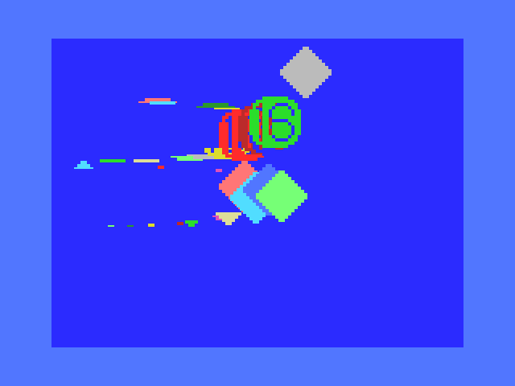

# 期待値(expected)

各サンプル(`scN_spNN`)の「正しい描画結果」を録画したロスレスwebmの置き場所です。

- ファイル名はasm/pythonファイルと同じにします (例: `sc1_sp01.asm` → `sc1_sp01.webm`)
- 特定の実装(pythonエンジンなど)専用ではなく、**同じサンプルを検証する
  どの実装からも参照される共有データ**という位置づけです。
  現状は [../python/](../python) のテストが使っていますが、将来
  openMSXや実機を使ったテストを追加する場合も同じファイルと比較する想定です
- フォーマットの詳細(VP9 `gbrp`, 4倍拡大保存など)は
  [../python/video_expected.py](../python/video_expected.py) を参照してください
- 生成/更新は各テストファイルを `--update-expected` 付きで実行します
  (例: `python ../python/sc1_sp01.py --update-expected`)

## `*_openmsx.webm`

`scN_spNN.webm`(pythonエンジンで再現した期待値)とは別に、実際に
openMSXでROMを実行して録画したものを`scN_spNN_openmsx.webm`として
置くことがあります。撮り方は[../asm/capture_openmsx.py](../asm/capture_openmsx.py)
を参照してください。

パレット・背景色(R#7)はopenMSXで実測した値をエンジンに反映済みのため、
`sc1_sp01_openmsx.webm`はpython版とビット完全一致することを確認済みです。

<video controls src="https://github.com/hsk/vdplabo/raw/refs/heads/main/sprite/test/expected/sc1_sp01_openmsx.webm" muted="false" width="640" height="480"></video>

<video controls src="https://raw.githubusercontent.com/hsk/vdplabo/refs/heads/main/sprite/test/expected/sc1_sp08_openmsx.webm" muted="false" width="640" height="480"></video>

<video controls src="https://raw.githubusercontent.com/hsk/vdplabo/refs/heads/main/sprite/test/expected/sc1_sp08_openmsx.webm" muted="false"></video>

